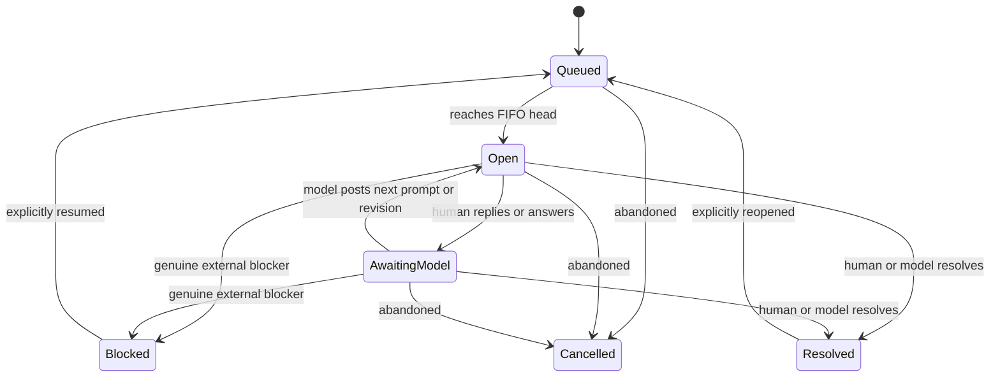

# Feedback Threads — Human Review Harness Specification

Status: Accepted v0.2 for implementation  
Scope: Debug-only `DeveloperSupport`, `DeveloperTools/PencilFixtureMCP`, and narrow App composition  
Primary user: Human reviewer using Phillip's physical iPad  
Primary client: Development model coordinating work through MCP

## 1. Objective

Replace the transactional review request/banner with a persistent review-session protocol. A feedback thread is the durable unit for a model review request, human replies, focused follow-up questions, human-triggered annotated viewport screenshots, implementation revision metadata, one bounded live A/B comparison, and final resolution.

This is development tooling, not product chat or project-management software. It remains absent from Release behavior. The existing pen-fixture protocol and corpus remain separate.

## 2. Accepted principles

- Feedback is conversational rather than verdict-first.
- Exactly one feedback thread owns the iPad review slot. Other feedback threads wait FIFO.
- A human reply does not resolve the thread. It moves the thread to `awaiting-model`, which retains the device slot.
- Both human and model may resolve, subject to optimistic concurrency.
- Resolved threads are terminal and immutable until explicitly reopened.
- The harness has only a minimal floating bar and a full-screen thread view. There is no intermediate expanded overlay.
- The model may ask for a screenshot but cannot trigger one. Capture and send are separate, explicit human actions.
- The initial structured interaction is single-choice only. Multi-choice and Pencil capture as feedback-thread interactions are deferred.
- A/B review is one compiled, Debug-only comparison seam with synchronized reset, not a generalized variant platform.
- Messages, answers, attachments, and events are append-only and idempotent.
- The review UI floats above the product and never changes its viewport geometry.
- Names use `feedbackThreadID` or another explicit feedback-thread term where bare `threadID` could be confused with product Pin terminology.

## 3. Lifecycle and queue

A feedback thread has one lifecycle state:

```text
queued
open
awaiting-model
blocked
resolved
cancelled
```

Only one feedback thread may be `open` or `awaiting-model`. That thread owns the active device slot. All other nonterminal threads are `queued`.



When the active feedback thread becomes `blocked`, `resolved`, or `cancelled`, the next queued thread advances and loads its pinned scenario cleanly. A blocked thread does not retain the device slot. Reopening or resuming joins the FIFO queue unless the slot is idle, in which case it opens immediately. When it joins an occupied queue it receives a new queue sequence after existing waiters; its message history and per-thread sequences are preserved.

### Optimistic concurrency

Every append receives a monotonic sequence number. A state-changing model call includes the last human/message sequence it consumed. A model resolve is rejected if a newer message exists. State changes record:

- actor (`human`, `model`, or `system`);
- last-consumed sequence;
- resulting sequence and timestamp;
- idempotency key.

This prevents a model from resolving across unseen newer human feedback. Repeating an accepted operation with the same idempotency key returns the original result rather than appending again. Duplicate create is stricter: it also requires the original owner token.

## 4. Ownership, delivery, and identity

Keep the existing queue guarantees:

- `owner_token` is returned only on the first successful create;
- only its SHA-256 hash is persisted;
- owned mutation, await, collection, and state calls require the matching token;
- a duplicate `create_feedback_thread` must present the original `owner_token`; it returns the original record without minting or revealing another token;
- `requester_id` remains in durable records and collected output;
- the delivery target is pinned at creation and polling never changes it;
- enqueue order is stable across MCP processes;
- thread and message creation are idempotent.

Owner tokens must never appear in device records, Mac mirrors, event logs, or exported evidence.

## 5. Core conversational workflow

1. The model creates a feedback thread with title, objective, initial message, pinned scenario, and an idempotency key.
2. The thread opens immediately when the review slot is idle; otherwise it is queued FIFO.
3. Activation loads the thread's deterministic scenario with a clean reset.
4. The minimal bar appears without resizing or refitting the product.
5. The human opens the full thread view and replies, answers a question, captures an annotation, blocks, or resolves.
6. A human reply is appended and moves the thread to `awaiting-model` while retaining the active slot.
7. The model collects the update and normally asks no more than one focused clarification before revising. It asks another only if the answer exposes a materially different ambiguity.
8. The model posts a question or revision, returning the thread to `open`, or performs an optimistic state transition.
9. Terminal or blocked state advances the next queued thread and removes stale controls immediately.

Text follow-ups preserve the current product surface unless their normal message carries an explicit surface directive.

## 6. User interface

### 6.1 Minimal product-facing bar

The floating bar is draggable and collapsible. It may show only compact session information such as title, state, unread count, queue count, and a control to enter the full thread view. It is an overlay and does not participate in product layout.

During the registered live A/B comparison only, it additionally exposes:

```text
[A] [B] [Reset]
```

There is no rich intermediate expanded overlay and no conversation composer over the product.

### 6.2 Full-screen thread view

The full-screen view contains:

- complete chronological, append-only history;
- the current free-text composer or single-choice question;
- clean and annotated screenshot previews;
- implementation and surface revision markers;
- human actions for `Reply`, `Capture & Annotate`, `Blocked`, and `Resolve`;
- live A/B preference controls when the registered comparison is active.

Leaving the view returns to the same product surface without resetting it. Submitted replies and completed questions become read-only. Only the newest unanswered interaction is editable. No duplicate composer or stale Reset-only prompt may remain after submission or queue advancement.

## 7. Questions

M1 supports free-text questions. M3 adds single-choice questions with:

- one selected option;
- optional comment;
- optional human-triggered annotated screenshot.

The answer is an append-only message and uses an idempotency key. After completion, both question and answer are read-only. Answering leaves the thread in `awaiting-model`; it does not resolve or reset the scenario.

Multi-choice and Pencil capture requests are not feedback-thread interaction types in v0.2. Authentic Pencil fixture capture continues through `request_pen_fixture` and its existing corpus.

## 8. Human-triggered annotated screenshots

### 8.1 Consent boundary

The model may request visual clarification in a normal message. It cannot invoke capture. Only the human can tap `Capture & Annotate`, preview the result, and explicitly send it.

### 8.2 Flow

1. The human taps `Capture & Annotate` in the full-screen thread view.
2. The harness captures the TuberNotes product viewport while excluding all feedback-thread UI.
3. A frozen preview opens.
4. The human may draw with Apple Pencil, add a one-line caption, cancel, or send.
5. `Cancel` creates no sent attachment and no successful attachment message.
6. `Send` atomically persists attachment metadata and appends its owning message.
7. The MCP collection path mirrors both PNGs to durable model-accessible paths.

M2 persists:

- clean PNG;
- composited annotated PNG;
- pixel dimensions and orientation;
- scenario;
- surface revision;
- feedback-thread ID and owning message ID;
- capture and send timestamps;
- optional caption.

Photos import, custom media-library behavior, editable drawing archives, deletion UX, and elaborate retake flows are deferred. Captures from other apps or system UI are prohibited.

## 9. Revisions and surface directives

Thread state and product-surface state are separate. A normal message may carry bounded revision metadata:

```json
{
  "summary": "Adjusted the Pin callout anchor.",
  "buildID": "debug-2026-07-16-01",
  "scenario": "pin-drift",
  "surfaceRevision": 2,
  "resetPolicy": "clean"
}
```

Reset policy is one of:

- `preserve`: keep the current product surface; default for follow-ups;
- `clean`: reload the named deterministic scenario;
- `new-revision`: rebuild the surface only when the revision changes.

Advancing to a different feedback thread always loads that thread's pinned scenario cleanly. Revision metadata is evidence carried on a message, not a CI, deployment, or build-management subsystem.

## 10. One bounded live A/B seam

M4 registers one Debug-only live comparison, preferably a small existing Pin presentation surface that requires no product-contract change.

- A and B are compiled into one manually integrated build.
- Both render switch-in-place in the identical product viewport geometry.
- Switching does not reinstall or relaunch the app.
- Every switch and `[Reset]` applies the same deterministic synchronized reset.
- The minimal bar exposes `[A] [B] [Reset]` only while comparison is active.
- The full thread view offers `Prefer A`, `Prefer B`, `Neither`, and `No preference`, with optional comment and human-triggered annotation.
- The event log records each variant exposure, switch, reset, and submitted preference.
- Unknown comparison and variant identifiers fail visibly and safely.

This is one explicit registry seam, not a reusable variant framework. Independent per-variant state, side-by-side comparison, generalized component/architecture variants, arbitrary model-authored UI, hot-loaded Swift, and automated worktree merging are out of scope. Worktrees may be used for authoring, but runtime review uses the one integrated binary.

## 11. Data contract

Names below are illustrative; stored keys must avoid collision with product Pin `threadID` terminology.

```swift
struct FeedbackThreadRecord {
    var feedbackThreadID: String
    var title: String
    var objective: String
    var state: FeedbackThreadState
    var requesterID: String
    var target: DeliveryTarget
    var scenario: String
    var surfaceRevision: Int
    var lastSequence: Int
    var lastConsumedSequence: Int?
    var createdAt: Date
    var updatedAt: Date
}

struct FeedbackThreadMessage {
    var messageID: String
    var feedbackThreadID: String
    var sequence: Int
    var author: Author
    var body: String?
    var interaction: Interaction?
    var attachmentIDs: [String]
    var surfaceDirective: SurfaceDirective?
    var createdAt: Date
    var idempotencyKey: String
}
```

Authors are `model`, `human`, and `system`. Messages, answers, attachments, and state events are append-only. A resolved record is immutable until an explicit, authorized reopen transition.

## 12. MCP surface

The initial surface has exactly seven feedback-thread operations:

1. `create_feedback_thread` — create idempotently, pin target/scenario, and enqueue or activate.
2. `post_thread_message` — append a normal model message, optionally carrying bounded revision/surface metadata.
3. `ask_thread_question` — append a free-text or single-choice question.
4. `await_thread_response` — bounded poll for a newer human response without changing delivery target.
5. `collect_thread_updates` — return messages and attachment paths after a sequence cursor.
6. `set_feedback_thread_state` — perform authorized optimistic transitions, including block, resolve, cancel, resume, and reopen.
7. `get_feedback_thread` — retrieve the durable record, ordered history, active state, and queue position.

M5 adds one bounded operation:

8. `export_feedback_thread` — write one thread's readable Markdown history and paths for attachments already collected to the Mac mirror into an evidence directory, then return those paths.

No separate list, queue-advance, attachment-delete, attachment-collection, comparison-post, resolve, reopen, or cancel operation is part of v0.2. Attachments arrive through messages and are returned by cursor collection. Queue advancement is state-machine behavior. Comparison and revision directives travel on normal messages.

Collection uses an exclusive `afterSequence` cursor so polling never duplicates messages. Await has a finite caller-selected timeout and is safe to repeat. All mutating operations accept idempotency keys; owned calls enforce `owner_token`.

## 13. Durable storage and export

Device-side canonical storage:

```text
Documents/
  feedback-threads/
    queue.json
    events.jsonl
    <feedback-thread-id>/
      thread.json
      messages/
        000001.json
        000002.json
      attachments/
        <attachment-id>-clean.png
        <attachment-id>-annotated.png
```

Gitignored Mac mirror:

```text
.feedback-threads/
  queue.json
  event-log.jsonl
  threads/<feedback-thread-id>/
    thread.json
    messages/*.json
  collected/<feedback-thread-id>/
    device/...
    evidence/feedback-thread.md
  attachments/<feedback-thread-id>/*.png
```

Collected attachment paths are added to the owning message's attachment metadata as `collectedPaths`; they are not maintained in a separate attachment index. The per-thread `collected/.../device` directory is the raw pull, while durable PNG copies live under `attachments/<feedback-thread-id>/`.

Every meaningful event is appended to JSONL with event ID, feedback-thread ID, sequence, timestamp, requester ID, pinned target, scenario, surface revision, and relevant message/attachment/comparison fields. Required events cover creation, queueing, activation, message/question/answer, state transition, capture cancellation/send/collection, surface revision, variant exposure/switch/reset/preference, reopen, and export.

`export_feedback_thread` writes a bounded Markdown transcript plus references only to durable attachments already collected into the Mac mirror. Export does not pull uncollected device attachments implicitly. It does not add a general export UI, archive browser, search index, or storage dashboard.

## 14. Reliability, security, and privacy

- Queue order is deterministic and exactly one feedback thread owns the review slot.
- `awaiting-model` retains the slot; `blocked`, `resolved`, and `cancelled` release it.
- Per-thread sequences are monotonic; append and answer operations are idempotent.
- Relaunch restores the active thread, queue, history, unread state, and current surface metadata.
- State transitions reject stale last-consumed sequences.
- Failed attachment writes create neither a successful message nor partial attachment metadata.
- The clean and annotated PNG paths returned to the model are durable Mac-side copies.
- Thread controls disappear immediately after terminal/blocked transition and cannot mutate resolved history.
- The feedback UI never changes canvas geometry.
- Screenshot capture and send each require explicit human action; capture excludes the harness UI.
- The system is Debug-only and does not bypass iOS permissions.
- Owner tokens are never persisted or exported in plaintext.
- Pen fixtures remain a separate protocol and corpus.

## 15. Milestones and acceptance

### M1 — Conversational durable feedback threads

- persistent records and append-only messages;
- FIFO queue with one active slot and `awaiting-model` retention;
- ownership, target pinning, idempotency, and optimistic transitions;
- minimal floating bar and full-screen free-text conversation;
- seven MCP operations;
- device persistence, Mac mirror, cursor collection, JSONL events, and relaunch restoration;
- correct clean scenario load on queue advancement;
- existing pen-fixture behavior remains functional and separate.

### M2 — Human-triggered annotated screenshots

- capture only from a human action;
- harness UI excluded by construction;
- frozen preview with Pencil annotation, optional one-line caption, explicit Send/Cancel;
- atomic clean/annotated PNG persistence and durable Mac paths;
- cancelled/failed capture produces no sent attachment or successful message.

### M3 — Single-choice questions

- one answer with optional comment and annotation;
- append-only, read-only completion;
- idempotent answer submission.

### M4 — One live A/B seam

- two compiled live variants in one build;
- identical geometry, switch-in-place, synchronized reset;
- `[A] [B] [Reset]`, preference collection, and exposure/switch/reset/preference events.

### M5 — Evidence export and operational finish

- bounded `export_feedback_thread` writes Markdown and paths for already-collected attachments;
- relaunch, queue recovery, and event logging have focused mechanical coverage;
- implemented MCP workflow is documented.

The milestone is accepted mechanically only with focused state/persistence/MCP tests, a successful Debug device build/install/launch, deterministic scenario inspection, and a scoped final diff. Human consent, Pencil feel, interaction taste, and A/B preference remain morning checks and must not be fabricated.

## 16. Deferred and prohibited scope

Deferred from v0.2:

- rich intermediate overlay;
- Photos import or general media management;
- editable drawing archives, attachment deletion UX, elaborate retake flows;
- multi-choice and feedback-thread Pencil-capture interactions;
- search, archive UI, storage dashboards, notifications, and generalized cleanup;
- generalized component or architectural variant platforms;
- independent A/B state, per-variant reset controls, side-by-side presentation;
- automated worktree integration or a mini CI/build system.

Prohibited:

- Release/product chat behavior;
- remote or automatic screenshot capture/send;
- capture of another app or system UI;
- arbitrary model-supplied executable UI or hot-loaded Swift;
- changes to frozen contracts, product Pin design, permissions, or module ownership.
